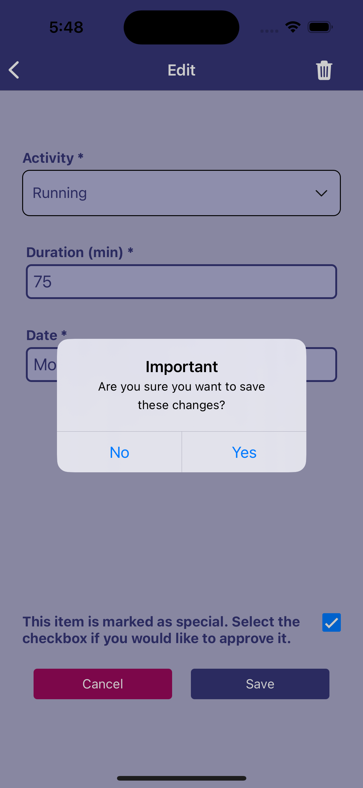

# Health & Fitness Tracking App

A React Native mobile application for tracking fitness activities and diet entries. The app features a dark/light theme toggle and real-time data synchronization with Firebase.

## Features

### Activity Tracking
- Log various types of exercises (Walking, Running, Swimming, Weights, Yoga, Cycling, Hiking)
- Track duration and date of activities
- Special highlighting for intense workouts (Running or Weight Training > 60 mins)
- Edit or delete existing activities
- Real-time updates using Firebase

### Diet Tracking
- Record food intake with descriptions and calorie counts
- Track meal dates
- Special highlighting for high-calorie meals (>800 calories)
- Edit or delete existing diet entries
- Real-time updates using Firebase

### User Interface
- Bottom tab navigation for easy access to different sections
- Native stack navigation for detailed views
- Dark/light theme toggle
- Consistent cross-platform design (iOS & Android)
- Real-time visual feedback on user interactions

## Technical Stack

- React Native
- Firebase Firestore
- React Navigation (Stack & Tab)
- React Context (Theme management)
- Environment Variables for secure configuration
- Custom components using Pressable for cross-platform consistency

## Installation

1. Clone the repository
```bash
git clone [repository-url]
```

2. Install dependencies
```bash
npm install
```

3. Create a `.env` file in the root directory and add your Firebase configuration:
```
FIREBASE_API_KEY=your_api_key
FIREBASE_AUTH_DOMAIN=your_auth_domain
FIREBASE_PROJECT_ID=your_project_id
FIREBASE_STORAGE_BUCKET=your_storage_bucket
FIREBASE_MESSAGING_SENDER_ID=your_messaging_sender_id
FIREBASE_APP_ID=your_app_id
```

4. Start the application
```bash
npm start
```

## Project Structure

```
src/
├── Components/
│   ├── ItemsList.js
│   └── Button.js
├── Screens/
│   ├── Activities.js
│   ├── Diet.js
│   ├── AddActivity.js
│   ├── AddDiet.js
│   ├── EditEntry.js
│   └── Settings.js
├── helpers/
│   └── styles.js
└── context/
    └── ThemeContext.js
```

## Screenshots





## Contributing

1. Fork the repository
2. Create your feature branch (`git checkout -b feature/AmazingFeature`)
3. Commit your changes (`git commit -m 'Add some AmazingFeature'`)
4. Push to the branch (`git push origin feature/AmazingFeature`)
5. Open a Pull Request

## License

This project is licensed under the MIT License - see the LICENSE.md file for details

## Acknowledgments

- React Native Documentation
- Firebase Documentation
- Expo Icons
